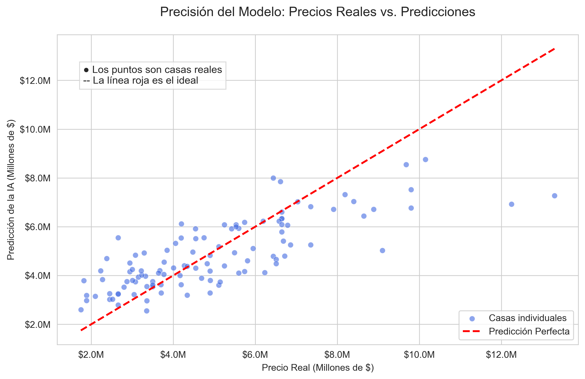
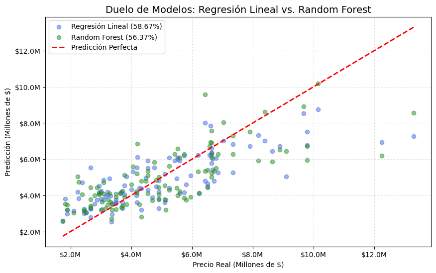
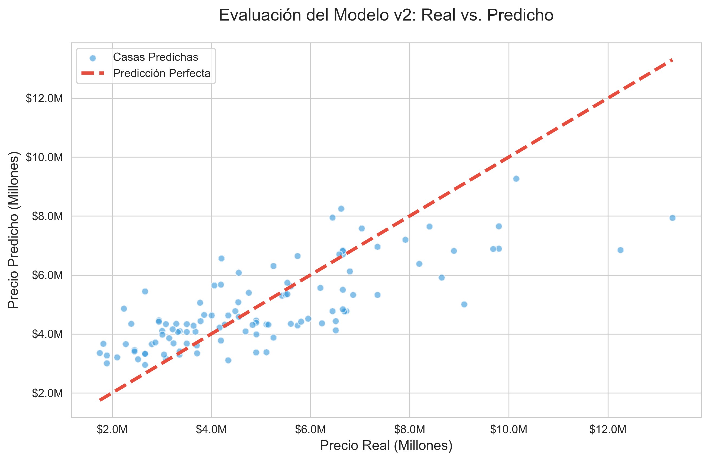

# 🏡 Housing IA Project - Predicción de Precios


Este proyecto utiliza **Machine Learning** para predecir el precio de viviendas basándose en características como el área, número de habitaciones, baños y servicios adicionales.

---

## 📊 Origen de los Datos

Los datos utilizados en este proyecto fueron obtenidos de **Kaggle**, específicamente del dataset  
**[Housing Price Prediction](https://www.kaggle.com/datasets/yasserh/housing-prices-dataset)**.

El dataset original fue procesado para normalizar unidades de medida y transformar variables categóricas para el entrenamiento de los modelos.

---

## 🚀 Logros del Proyecto

- **Mejor Modelo**: Regresión Lineal con una precisión del **58.67% (R²)**.
- **Experimentación**: Se comparó con **Random Forest Regressor** (56.62%) para validar el rendimiento, concluyendo que para este volumen de datos, el modelo lineal generaliza mejor.
- **Procesamiento de Datos**:
  - Conversión de unidades (Sqft a m²)
  - Tratamiento de valores nulos
  - Codificación de variables categóricas (One-Hot Encoding)
- **Visualización Avanzada**: Gráficos con formato de moneda (Millones de $) y comparativas de rendimiento.

## 🚀 Mejoras del Modelo de Regresión Lineal (v2)
En esta versión, mejoramos la capacidad predictiva del modelo mediante **Ingeniería de Variables**:
* **Servicios Total**: Combinación de aire acondicionado y parqueadero.
* **Amplitud por Habitación**: Relación entre el área total y el número de cuartos.
* **Categoría Premium**: Identificación de casas con múltiples baños y servicios de lujo.

## 📊 Resultados
* **Precisión R²**: 56.17%
* **Error Medio Absoluto (MAE)**: $1,133,262 (Este valor indica la desviación promedio de nuestras predicciones).

---

## 📖 Diccionario de Datos

| Columna | Descripción |
|----------|------------|
| **area_m2** | Tamaño de la vivienda convertido a metros cuadrados. |
| **bedrooms** | Cantidad de habitaciones. |
| **bathrooms** | Número de baños completos. |
| **airconditioning_num** | Presencia de aire acondicionado (1: Sí, 0: No). |
| **parking** | Capacidad de estacionamiento (número de vehículos). |
| **price** | Precio de venta final (Variable objetivo). |

---

### 📊 Visualización de Resultados
A continuación se muestra la relación entre los precios reales del dataset de prueba y las predicciones realizadas por el modelo. La línea roja punteada representa la predicción perfecta.

### Grafico regresión lineal:


### Comparativa: Lineal vs. Random Forest

Análisis de rendimiento entre un modelo simple y uno complejo:



---

## 🛠️ Instalación y Uso

Para replicar este proyecto localmente, sigue estos pasos:

### 1 Clonar el repositorio

```bash
git clone https://github.com/IvanBohorquez21/Housing-IA-Project.git
```

### 2️ Instalar dependencias

```bash
pip install -r requirements.txt
```

### 3️ Ejecutar los Notebooks

Abre VS Code o Jupyter Notebook y ejecuta los archivos en este orden:


    01_analisis_exploratorio.ipynb
    02_entrenamiento_modelo.ipynb
    03_mejora_modelo_rf.ipynb


---

## 📁 Estructura del Repositorio


    /data       → Dataset original de precios de vivienda
    /notebooks  → Procesos de análisis, limpieza y entrenamiento
    /models     → Modelos entrenados en formato .pkl listos para producción
    /img        → Gráficos y visualizaciones generadas para el análisis


---

## 📊 Fase 2: Feature Engineering y Resultados

En esta etapa, mejoramos el modelo original creando nuevas variables que aportan más contexto:
* **servicios_total**: Suma de aire acondicionado y parqueaderos.
* **amplitud_habitacion**: Área total dividida por el número de dormitorios.
* **es_premium**: Clasificación binaria para casas con alto equipamiento.

### 📈 Visualización de Predicciones
El siguiente gráfico muestra el desempeño del modelo actual (v2) comparando los precios reales vs. los predichos:



### 📉 Métricas Finales
* **Precisión (R²):** 56.17%
* **Error Medio Absoluto (MAE):** $1,133,262.05

## 🚀 Demo en Vivo
Puedes probar la aplicación interactiva aquí: [Simulador de Precios de Vivienda](https://vivienda-ia-ivan.streamlit.app/)

Proyecto desarrollado como parte de un flujo de aprendizaje en Ciencia de Datos.
